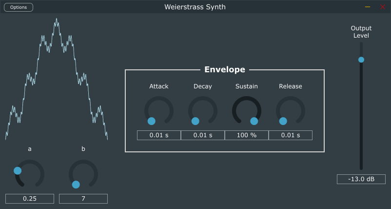

# Weierstrass Synth

A simple JUCE synth plugin that implements a synth based on the
[Weierstrass Function](https://en.wikipedia.org/wiki/Weierstrass_function).



## Build

Clone this repository:

```shell
git clone <blank>
```

Clone the `JUCE` repository into a subdirectory:

```shell
cd Weierstrass\ Synth
git clone https://github.com/juce-framework/JUCE
```

Configure the project with `cmake`:

```shell
cmake -DCMAKE_BUILD_TYPE:STRING=Release -S . -B "build"
```

Build the project:

```shell
cmake --build "build" --config Release --target all
```

The VST, AU, and Standalone plugins will be under `build/WeierstrassSynth_artefacts/Release/`.

Enjoy the plugin! Contributions are more than welcome. :)
